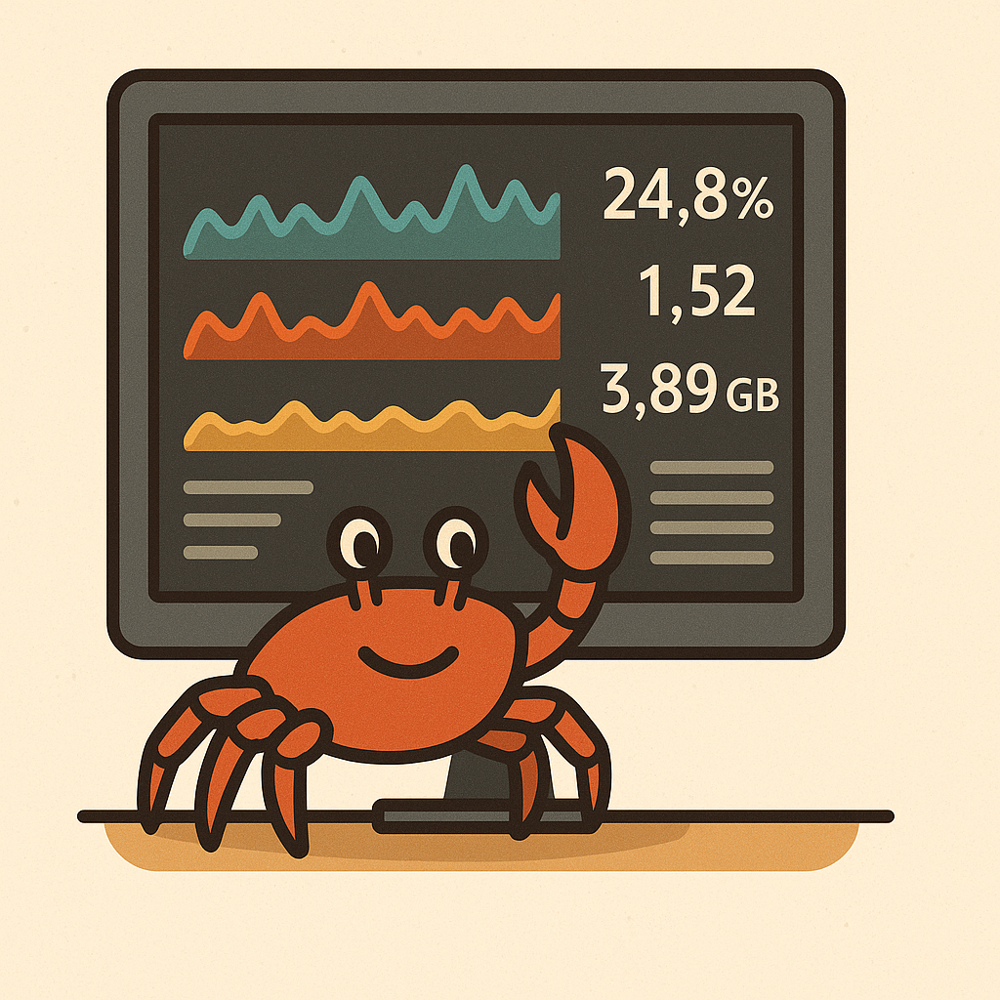

# crabmon 🦀

A fast, keyboard-driven terminal system monitor written in Rust, built on
[`ratatui`](https://github.com/ratatui-org/ratatui) and
[`sysinfo`](https://github.com/GuillaumeGomez/sysinfo).

crabmon shows per-core CPU history, memory and swap, a sortable/filterable
process table with a tree view and per-process disk IO, network throughput,
per-mount disk usage and IO, temperature sensors, GPU load and cgroup limits —
and it can print all of it as JSON or CSV for scripts.



## Features

- **CPU** — average-usage history chart plus a per-core strip, and a dedicated
  full-screen layout with one bar per core and live clock speeds.
- **Memory & swap** — usage gauges colour-coded green → yellow → red, with the
  reclaimable buffers/cache share spelled out so a scary "used" figure has its
  context.
- **Processes** — PID, user, state, CPU%, a CPU sparkline, RSS, virtual size,
  thread count, nice, disk IO, run time, listening ports and command, sortable on
  every column (keyboard or by clicking the header), with a tree view, a query
  language, and a detail pane on `Enter` showing the process's open sockets.
  Threads are hidden by default (`H` shows them), so the list reflects processes
  rather than every kernel task. Tag several with `Space` to signal, renice or
  pin them at once, and `f` keeps one process at the top of the table however the
  rest churns. The column set can be fixed in the config instead of fitting the
  terminal width.
- **Process control** — signal menu, renice and CPU affinity. Signals take a
  two-step confirmation, and all three refuse to act if the PID was recycled
  while the prompt was open.
- **Network** — per-interface rates and totals with an RX/TX history chart.
  Loopback, bridges, veth pairs and VPN tunnels are excluded from the aggregate
  by default so the same bytes are not counted twice.
- **Disks** — one usage gauge per mount with live read/write throughput,
  including LVM and LUKS volumes, and a warning when a filesystem is running
  out of inodes rather than bytes.
- **Sensors** — temperatures grouped by driver, so a 22-core `coretemp` flood
  does not push the NVMe and chassis sensors off the panel.
- **GPU** — utilisation, VRAM and temperature from `/sys/class/drm`, with
  optional `nvidia-smi` support.
- **cgroups** — when the process is confined, an extra panel with the cgroup's
  own memory usage against its limit and its CPU quota, neither of which the
  host totals reflect.
- **Pressure** — PSI stall time (`some` and `full`) for CPU, memory and IO: the
  number that explains a machine that feels frozen while the CPU graph looks
  idle.
- **Power** — battery charge, charge/discharge watts, time remaining, cell
  health, mains state, and CPU package draw from RAPL where it is readable.
- **Grouping** — aggregate the process table by systemd unit, container or user,
  totalling CPU, memory and disk IO per group, and `Enter` to open a group into
  the processes behind it.
- **Alerts** — configurable thresholds with a hold time, command hooks for both
  firing and recovering, and a log of every transition.
- **Export** — write a snapshot as JSON or CSV from the TUI, or run
  `crabmon --once` headless.
- **Record & replay** — `--record` writes every sample to a JSONL file (trimmed
  to keep it a sane size) and `--replay` drives the whole UI from one, so "send
  me a recording of the slowdown" is a workable bug report.
- **Diff** — `--diff before.json after.json` reduces two snapshots to what
  actually changed: what started, what exited, what grew.
- **Watch** — `--watch 'state:D'` blocks until something matches and exits
  non-zero, so a shell script can wait on a condition.
- **Prometheus** — `--serve :9100` runs headless and exposes CPU, memory, swap,
  load, disks, interfaces, sensors, pressure, power and GPU, plus the busiest
  processes (capped, and configurable). The cgroup panel has no series yet.
- **Remote** — `--remote host` monitors another machine over SSH, with no
  daemon and no open port, over one long-lived session rather than a process
  per sample.
- **Never blocks** — sampling runs on its own thread, so a slow `nvidia-smi`, a
  wedged NFS mount or a stalled SSH link leaves the interface responsive instead
  of freezing it.
- **Action log** — every signal, renice and affinity change is recorded to a
  local file, viewable in the TUI with `L`.
- **Themes and layouts** — five colour themes, four layouts, and a config file
  that covers every panel, threshold and colour.

## Install

### From source

```sh
cargo build --release
./target/release/crabmon
```

Requires a recent stable Rust toolchain (edition 2021).

### Debian package

```sh
./scripts/build-deb.sh
```

The result is `target/debian/crabmon_<version>_<arch>.deb`, which installs the
binary, the man page and shell completions:

```sh
sudo dpkg -i target/debian/crabmon_*.deb
```

## Usage

Run `crabmon`. It draws into the alternate screen and restores your terminal on
exit, including after a panic.

```
crabmon                              # dashboard
crabmon -s mem -l processes          # full-width process table, sorted by memory
crabmon -f 'user:root cpu>5' -t      # filtered, tree view
crabmon --once --top 20              # top 20 processes as JSON, then exit
crabmon --once --format csv          # ...or as CSV
crabmon --record run.jsonl           # record this session
crabmon --replay run.jsonl           # ...and replay it later
crabmon --remote build-server        # another machine, over SSH
crabmon --serve :9100                # headless Prometheus exporter
crabmon -g service                   # aggregate by systemd unit
crabmon --diff before.json after.json # what changed between two snapshots
crabmon --diff run.jsonl             # ...or between the ends of one recording
crabmon --watch 'state:D' --watch-for 30   # block until something is stuck
crabmon --stream > frames.jsonl      # one JSON snapshot per line, forever
```

Signals, renice and affinity apply to every tagged process when there are any,
so `/`-filter, `Space` a few rows, then `t` is the fast path for cleaning up a
run of stuck workers.

### Options

| Option | Meaning |
| --- | --- |
| `-r`, `--refresh <MS>` | Refresh interval, 200–10000 ms |
| `-s`, `--sort <KEY>` | `pid`, `name`, `cpu`, `mem`, `virt`, `disk`, `time`, `user`, `state`, `threads`, `nice` |
| `-a`, `--ascending` | Sort ascending |
| `-d`, `--descending` | Sort descending (the default) |
| `-f`, `--filter <QUERY>` | Initial process filter |
| `-t`, `--tree` | Start in process-tree view |
| `-l`, `--layout <NAME>` | `dashboard`, `processes`, `cpu`, `io` |
| `--theme <NAME>` | `default`, `mono`, `nord`, `solarized`, `gruvbox` |
| `--no-color` | Disable colour (same as `--theme mono`) |
| `--no-mouse` | Do not capture mouse events |
| `-1`, `--once` | Print one snapshot and exit (this host only) |
| `--format <FMT>` | `json` or `csv`, for `--once` |
| `-n`, `--top <N>` | Limit `--once` and `P` snapshot output to the top N processes |
| `-c`, `--config <PATH>` | Use an alternate config file |
| `-g`, `--group <BY>` | Group processes: `none`, `service`, `container`, `user` |
| `--record <PATH>` | Record every sample to a JSONL file, replacing it if it exists |
| `--replay <PATH>` | Replay a recording instead of sampling this host |
| `--remote <TARGET>` | Monitor TARGET over SSH (needs crabmon installed there) |
| `--remote-command <C>` | Command to run on the remote host |
| `--serve <ADDR>` | Serve Prometheus metrics on ADDR, headless (this host only) |
| `--stream` | Print one JSON snapshot per line forever (this host only) |
| `--diff <A> [B]` | Compare two snapshots, or one recording end to end |
| `--watch <QUERY>` | Block until processes match QUERY, then exit 1 |
| `--watch-for <SECS>` | ...only once the match has held this long |
| `--watch-timeout <SECS>` | ...giving up after this long; 0 waits forever |
| `-h`, `--help` / `-V`, `--version` | Help / version |

### Key bindings

| Key | Action |
| --- | --- |
| `q`, `Ctrl-C` | Quit |
| `↑`/`k`, `↓`/`j` | Move selection |
| `PgUp`, `PgDn` | Move a page |
| `Home`, `End` | First / last process |
| `Enter` | Process detail pane, or open the selected group |
| `/` | Filter processes |
| `Esc` | Clear the filter |
| `c` `m` `p` `n` `d` | Sort by CPU / memory / PID / name / disk IO |
| `<`, `>` (or `,` `.`) | Previous / next sort column |
| `s` | Reverse the sort order |
| click a header | Sort by that column |
| `T` | Toggle the process tree |
| `H` | Show or hide individual threads |
| `G` | Group by service, container or user |
| `Space` | Tag a process for a bulk action |
| `U` | Untag everything |
| `f` | Pin a process to the top of the table |
| `F` | Unpin everything |
| `z` | Pause and resume sampling |
| `[`, `]` | Step a recording back or forward |
| `{`, `}` | Step a recording ten frames |
| `1`–`9` | Apply a saved filter |
| `0` | Clear the filter |
| `y` | Copy the command line to the clipboard |
| `L` | Action log |
| `Tab`, `Shift-Tab` | Next / previous layout |
| `v` | Count virtual interfaces in the network total |
| `g` | Group or expand sensors |
| `+`, `-` (or `=` `_`) | Refresh faster / slower |
| `t` | Signal menu *(Unix)* |
| `r` | Renice *(Unix)* |
| `A` | CPU affinity *(Linux)* |
| `P` | Export a snapshot |
| `!` | Active alerts and the rules behind them |
| `?`, `F1` | Show all key bindings |
| mouse wheel | Scroll the process list |
| mouse click | Select a process |
| `j`/`k`, PgUp/PgDn in a popup | Scroll it |

Pressing the key of the column you are already sorting by reverses the order.

**Filter mode** (`/`) filters as you type. `Enter` returns to navigation keeping
the filter, `Esc` clears it. A malformed query is shown in red rather than
silently matching nothing.

**Signal menu** (`t`) offers SIGTERM, SIGKILL, SIGINT, SIGHUP, SIGQUIT, SIGSTOP,
SIGCONT, SIGUSR1 and SIGUSR2. A confirmation prompt asks `y`/`n` before anything
is sent, and the signal is refused if the PID was recycled while the prompt was
open.

**Saved filters** (`1`–`9`) come from `[[filter_preset]]`. A fresh config ships
five: `busy` (`cpu>5`), `hungry` (`mem>500M`), `mine` (`user:$USER`), `io`
(`io>100K`) and `stuck` (`state:D`). `0` clears the filter again.

### Filter language

Terms are separated by whitespace and combined with AND; `!` negates a term.

```
firefox            name contains "firefox"
!kworker           name does not contain "kworker"
user:vlad          user name contains "vlad"
pid:1234           exact PID          ppid:1  exact parent PID
state:R            process state letter
service:sshd       systemd unit; service:- means "no unit"
container:abc123   container id; container:- means "not in one"
cmd:--headless     substring of the full command line
re:^chrom(e|ium)$  regular expression over the process name
cpu>5              CPU comparison, with > >= < <= =
mem>100M           resident memory, with K/M/G/T suffixes
io>1M              disk IO rate
```

## Recordings

`--record` writes one JSON object per sample. An existing file at that path is
replaced, not appended to. Frames are trimmed to the busiest 100 processes with
argv truncated to 200 characters, which is roughly 55 KiB a frame — about
240 MiB for an hour at the default interval. `[record]` controls all three
limits.

`--replay` opens a recording and drives every panel from it. Sampling is paused
by default while scrubbing: `[` and `]` step a frame, `{` and `}` step ten, and
`z` plays on. The whole recording is parsed into memory up front, so an
hours-long capture wants a machine with room for it.

## Comparing snapshots

```sh
crabmon --once > before.json
# ...the thing happens...
crabmon --once > after.json
crabmon --diff before.json after.json
```

The report is what changed: CPU, load, memory, swap and per-filesystem usage,
then the processes that started, exited and moved, biggest mover first. Passing
one path instead of two diffs a recording's first frame against its last.
`--format json` emits the same thing for something other than a human.

Processes are matched on PID *and* start time, so a recycled PID reads as one
process exiting and another starting rather than as a process that grew by
four gigabytes.

## Waiting for something

```sh
crabmon --watch 'state:D' --watch-for 30 --watch-timeout 600 && notify-send 'stuck IO'
```

`--watch` samples headlessly until the query matches. It exits **1** when it
does, printing the matching processes, and **0** if `--watch-timeout` elapses
first — so `&&` runs on a match and `||` on a clean run. `--watch-for` requires
the match to hold that many *consecutive* seconds, so a condition that flickers
once a minute does not count.

## Streaming

`--stream` prints one JSON snapshot per line, forever, trimmed by `[record]`
exactly as a recording is. It is what `--remote` runs on the far end, and it
works on its own as a collector:

```sh
crabmon --stream --refresh 5000 | while read -r frame; do ... ; done
```

## Configuration

Settings live at `$XDG_CONFIG_HOME/crabmon/config.toml`, typically
`~/.config/crabmon/config.toml`. The file is written when the refresh interval
changes and on exit. Missing or malformed files fall back to defaults, and
out-of-range values are clamped rather than rejected.

```toml
refresh_ms = 800            # clamped to 200..=10000
sort_by = "cpu"             # pid|name|cpu|mem|virt|disk|time|user|state|threads|nice
sort_desc = true
filter = ""                 # initial filter query
tree = false
show_threads = false        # Linux reports every task; threads are hidden by default
group_by = "none"           # none|service|container|user
layout = "dashboard"        # dashboard|processes|cpu|io
theme = "default"           # default|mono|nord|solarized|gruvbox
group_sensors = true
show_virtual_ifaces = false
# interface-name prefixes treated as virtual:
virtual_iface_prefixes = ["lo", "docker", "br-", "veth", "virbr", "tun", "tap",
                          "wg", "vmnet", "zt", "cni", "flannel", "kube", "utun"]
history_len = 240           # samples kept per chart, clamped to 16..=4096
panel_order = ["net", "psi", "sensors", "disks", "power", "gpu", "cgroup"]

[thresholds]
warn = 0.7                  # gauges turn yellow here
crit = 0.9                  # ...and red here
temp_warn = 0.75            # fraction of a sensor's critical temperature
temp_crit = 0.9

[panels]                    # every panel can be switched off
header = true
cpu = true
mem = true
procs = true
net = true
sensors = true
disks = true
gpu = true
cgroup = true
psi = true
power = true

[procs]
# Fixed column order; empty means fit as many as the terminal is wide enough
# for. Names: mark pid user state cpu trend mem virt thr ni disk time ports name
# COMMAND is always drawn last, and unknown names are ignored.
columns = []
ports = false               # look up listening ports for the rows on screen
pin_marker = true           # show the ▸ pinned / • tagged marker column

[remote]
# Hold one SSH session open and read a stream of frames instead of starting a
# process per sample. Falls back automatically if the far end predates --stream.
stream = true

[gpu]
enabled = true
nvidia_smi = false          # shell out to nvidia-smi each refresh

[export]
dir = ""                    # empty means the working directory
format = "json"             # json|csv
top_n = 0                   # 0 keeps every process

[record]
top_n = 100                 # processes kept per frame; 0 keeps all (~1.5 MB/frame)
omit_paths = false          # drop command lines, exe and cwd entirely
max_cmd_len = 200           # truncate argv; Chromium's runs to kilobytes

[serve]
top_procs = 20              # per-process series exported by --serve; 0 disables

[audit]
enabled = true
path = ""                   # empty means the platform state directory

# Queries bound to the number keys, in order. $USER is expanded.
# Declaring any preset replaces the built-in five rather than adding to them.
[[filter_preset]]
name = "busy"
query = "cpu>5"

[[filter_preset]]
name = "mine"
query = "user:$USER"

[colors]                    # override any theme colour by name:
# ok warn crit accent border title text dim sel_fg sel_bg
# values may be names ("red"), hex ("#ff8800") or 256-colour indexes ("33")
crit = "#ff5555"

[[alert]]
name = "cpu-saturated"
kind = "cpu"                # cpu|mem|swap|load|disk|temp|gpu
threshold = 90.0
for_secs = 30               # must hold this long before firing
target = ""                 # mount point, sensor prefix or GPU name
command = ""                # run once when the alert activates
command_clear = ""          # ...and once when it recovers
```

`!` lists the rules, which are firing, and a log of every transition — an alert
that fires at 03:12 and clears at 03:14 says both.

## Platform notes

- Sending signals and renice are **Unix-only**.
- CPU affinity, per-disk IO rates (`/proc/diskstats`), GPU statistics
  (`/sys/class/drm`) and cgroup limits are **Linux-only**. Those panels are
  simply absent elsewhere.
- Per-process disk IO needs permission to read `/proc/<pid>/io`, so other
  users' processes read as zero unless crabmon runs as root.
- PSI needs Linux 4.20+ with `CONFIG_PSI=y`; the panel is hidden otherwise.
- CPU package power needs readable RAPL counters, which are root-only on most
  kernels since CVE-2020-8694. Battery figures need no privileges.
- Per-disk IO on FreeBSD is read from `iostat -x`. That path is compile-checked
  in CI and unit-tested against captured output, but has not been run on real
  FreeBSD hardware.
- `--remote` needs crabmon installed on the far end and non-interactive SSH
  (`BatchMode=yes`). It holds one session open and reads a stream of frames,
  falling back to a process per sample if the far end predates `--stream`; a
  fetch that does not answer within 15 s is killed rather than left to hang. It
  applies to the TUI only: `--once`, `--serve`, `--stream` and `--watch` sample
  the host they run on and refuse to be combined with `--remote` or `--replay`.
- Temperature sensors depend on the OS exposing them; if none are available the
  panel says so.

## Development

```sh
cargo test                  # unit, behaviour, rendering, CLI and doc tests
cargo clippy --all-targets -- -D warnings
cargo fmt --all -- --check
```

The application logic lives in a library crate with the binary as a thin shell,
so the whole program is testable headlessly:

- `tests/app_behaviour.rs` drives the input handling against a fixture metric
  source.
- `tests/render.rs` renders the real panels onto a `TestBackend` and asserts on
  the resulting screen.
- `tests/cli.rs` exercises the built binary, including `--once` output.
- `tests/proc_control.rs` checks that renice, affinity and signals actually take
  effect, against real spawned processes.
- `tests/docs.rs` checks that this README, the man page and the shell
  completions still describe what the code does.

See [DESIGN.md](DESIGN.md).

## Changelog

See [CHANGELOG.md](CHANGELOG.md).

## License

MIT — see [LICENSE](LICENSE).
